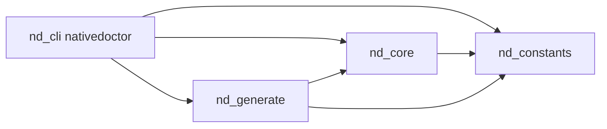

# nativedoctor

**nativedoctor** is a file-driven HTTP client: you describe requests in **JSON** or **YAML**, optionally wire **Rhai** post-response scripts, and run them from the command line or embed the engine in your own Rust code. It fits API exploration, smoke tests, and light automation without ad-hoc shell `curl` scripts.

- **Request files** — one HTTP call per file (method, URL, query, headers, body).
- **Template expansion** — `${VAR}` from process environment and a runtime map (writable from Rhai).
- **Sequences** — ordered steps sharing one **runtime environment** (tokens and variables flow forward).
- **OpenAPI 3.0.x** — generate starter request files from a spec (`generate`).
- **Post-scripts** — sandboxed **Rhai** scripts after each response (inspect body, set vars, log).

The CLI binary is named **`nativedoctor`**. The core logic lives in the **`nd-core`** crate; **`nd-generate`** implements OpenAPI import; **`nd-constants`** holds shared literals.

---

## Requirements

- **Rust** (2021 edition), stable toolchain, to build from source.
- Network access for real HTTP calls (optional: `--dry-run` only expands and prints).

---

## Install

### From source (workspace root)

```bash
cargo build --release -p nd-cli
```

The binary is at `target/release/nativedoctor`. Add that directory to your `PATH`, or run it by path.

### Prebuilt archives

If this repository publishes **GitHub Releases**, attaching archives is automated (see [Release binaries (CI)](#release-binaries-ci)). Download the archive for your OS and place the `nativedoctor` binary on your `PATH`.

---

## Quick start

**Run a single request file** (either form is equivalent):

```bash
nativedoctor run my-request.yaml
nativedoctor my-request.yaml
```

**Dry-run** (expand templates, print the request; no network):

```bash
nativedoctor run my-request.yaml --dry-run
```

**Run a sequence** (shared env across steps):

```bash
nativedoctor run -s my-sequence.yaml
```

**Scaffold files**:

```bash
nativedoctor new --request examples/hello.yaml
nativedoctor new --sequence examples/flow.yaml
```

**Generate requests from OpenAPI 3.0.x**:

```bash
nativedoctor generate -i openapi.json -o ./generated --format yaml
```

---

## CLI reference

Global options apply to subcommands that support them (see below).

| Option | Description |
|--------|-------------|
| `-v`, `--verbose` | More detailed output; default tracing filter `nd_core=debug` unless `RUST_LOG` is set. |
| `--env <FILE>` | Merge `KEY=value` lines from a dotenv-style file into the runtime (repeatable; later files override earlier). Applied after the process environment unless `--no-default-system-env` is set. |
| `--no-default-system-env` | Do not copy the current process environment into the runtime (only `--env` files and values set via Rhai `set`). |

### `run`

```text
nativedoctor run [OPTIONS] <FILE>
```

| Option | Description |
|--------|-------------|
| `-s`, `--sequence` | Treat `FILE` as a **sequence** definition (not a single request). |
| `--no-post` | Skip `post_script` for this run. |
| `--dry-run` | Expand and print only; no HTTP. |
| `--allow-error-status` | Do not fail on HTTP 4xx/5xx (post-script still runs first when present). |
| `<FILE>` | Path to a request or sequence file (`.json`, `.yaml`, `.yml`). |

**Shorthand:** if you omit the subcommand, a single positional `FILE` runs as a **single request** (same as `run` without `-s`). Flags such as `--dry-run` are only available on the explicit `run` subcommand in that form.

### `list`

```text
nativedoctor list <DIR>
```

Lists `*.json`, `*.yaml`, and `*.yml` in `DIR` (non-recursive, sorted). Missing directory yields no paths and a short message on stderr.

### `generate`

```text
nativedoctor generate -i <SPEC> -o <DIR> [--format yaml|json]
```

Reads **OpenAPI 3.0.x** (JSON or YAML). **OpenAPI 3.1** and some `$ref` patterns are rejected with an error. Writes one request file per operation under `DIR`.

### `new`

```text
nativedoctor new --request <PATH>
nativedoctor new --sequence <PATH>
```

Writes a starter request or sequence document. Extension must be `.json`, `.yaml`, or `.yml`. Refuses to overwrite an existing file.

---

## Request files

A request file wraps an `HttpRequestSpec` under a top-level `request` key. Supported extensions: **`.json`**, **`.yaml`**, **`.yml`**.

Minimal YAML example:

```yaml
version: "0.0.0"
name: Example GET
request:
  method: GET
  url: https://httpbin.org/get
  query:
    foo: bar
  headers: {}
  body: null
  follow_redirects: true
  verify_tls: true
```

Useful fields (non-exhaustive):

| Area | Notes |
|------|--------|
| `method` | Any case; normalized when sending. |
| `url` | May contain `${VAR}` placeholders. |
| `query` / `headers` | String maps; values may use `${VAR}`. |
| `body` | Omitted or `null` for no body. JSON object/array → JSON body; string → text. Structured bodies support explicit `type` (e.g. `json`, `text`, `binary`, …). |
| `timeout_secs` | Optional; default comes from the schema (see `nd-core`). |
| `follow_redirects` | Default `true`. |
| `verify_tls` | Default `true`; set `false` only for local/dev. |
| `post_script` | Optional path, **relative to the request file’s directory**, to a Rhai script. |

**JSON Schema** for tooling: `nd_core::request_file_json_schema()` exposes a JSON Schema for `RequestFile`.

---

## Sequences

A sequence file lists **steps**; each step’s `file` is relative to the sequence file’s directory.

```yaml
version: "0.0.0"
name: My flow
steps:
  - file: login.yaml
  - file: fetch-resource.yaml
```

Execution rules (summary):

- One shared **`RuntimeEnv`** for all steps (environment + values set via Rhai `set` / templates).
- **Outcome policy** differs from a single request: with an active post-script, HTTP errors can be handled in script; without one, a failing status may fail the step (see `OutcomePolicy::SequenceStep` in `nd-core`).

Run with:

```bash
nativedoctor run -s sequence.yaml
```

---

## Environment and `${VAR}` templates

Before the request is sent, strings in URLs, query values, headers, and JSON/text bodies are expanded using **`${IDENT}`** (identifier rules: letters, digits, underscore; see template implementation in `nd-core`).

By default the CLI seeds the runtime map from the **current process environment**, then merges each **`--env`** file in order (dotenv-style: `KEY=value`, `#` comments, optional `export` prefix; double- or single-quoted values).

With **`--no-default-system-env`**, the map starts empty (no process snapshot); use **`--env`** to supply variables or rely on Rhai `set` during the run.

Resolution order for lookups:

1. **Runtime map** (process copy unless disabled, then `--env` merges, then Rhai `set`).
2. **`std::env::var`** when the runtime was built with process fallback (default CLI behavior).

Missing variables produce an error at expansion time.

---

## Post-scripts (Rhai)

Optional **`post_script`** on a request file points to a **Rhai** script. It runs **after** the HTTP response is received. The engine has **no filesystem and no network** inside Rhai; it only sees the response and the shared env API.

Built-ins (see `nd_core::rhai::run_post_script` docs for details):

| Function | Role |
|----------|------|
| `status()` | HTTP status code |
| `headers(name)` | Header value (name as stored) |
| `body()` | Response body as string (UTF-8 lossy) |
| `json()` | Parsed JSON as Rhai value, or unit if invalid |
| `env(key)` | Read from `RuntimeEnv` |
| `set(key, value)` | Update runtime map (stringified value) |
| `log(level, message)` | Emit tracing; optional in-memory capture when a `Logger` is supplied |

---

## OpenAPI generation

**Supported:** OpenAPI **3.0.x** (JSON or YAML input to `generate`).

**Not supported (today):** OpenAPI **3.1** (rejected explicitly), path/item `$ref` indirection, some parameter/body `$ref` patterns.

Generated URLs may use **`${BASE_URL}`** when the spec has no `servers` entry (constant in `nd-constants`). Path `{param}` segments become **`${param}`** template syntax.

---

## Using the library (`nd-core`)

Add a path or crates.io dependency on **`nd-core`** (when published). Typical entry points:

- **Load / expand:** `load_request_file`, `prepare_request_file`, `prepare_request_with_env`, `expand_string`, `expand_json_value`
- **Execute:** `execute_request_with_env`, `RunOptions`, `OutcomePolicy`, `ExecutionResult`
- **Sequences:** `execute_sequence`, `load_sequence_file`, `sequence_step_iter`
- **Post-script only:** `execute_request_post_script`, `run_post_script`
- **Discovery:** `list_request_paths`

Install a **`tracing`** subscriber in your binary if you want logs from the core crate (mirrors what the CLI does with `RUST_LOG` / `--verbose`).

---

## Workspace layout

```text
crates/
  nd-cli/        # CLI binary package (nativedoctor)
  nd-core/       # HTTP execution, templates, Rhai, sequences
  nd-generate/   # OpenAPI → request files (openapi3 module)
  nd-constants/  # Shared version strings, placeholders, header names, etc.
```



---

## Development

```bash
cargo build --workspace
cargo test --workspace
cargo fmt --all
cargo clippy --workspace -- -D warnings
```

---

## Release binaries (CI)

Publishing a **GitHub Release** (not draft-only) triggers `.github/workflows/release.yml`, which builds **`nativedoctor`** for Linux x86_64, Windows x86_64, macOS Apple Silicon, and macOS Intel, then uploads archives to that release. Builds use the release **tag** as the checkout ref so assets match the tagged sources.

---

## Contributing

Issues and pull requests are welcome. When changing behavior, update this README and any affected `///` / `//!` documentation in the crates you touch.
