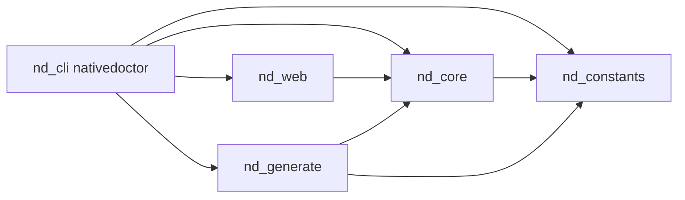

# nativedoctor

**nativedoctor** is a file-driven HTTP client: you describe requests in **JSON** or **YAML**, optionally wire **Rhai** post-response scripts, and run them from the command line or embed the engine in your own Rust code. It fits API exploration, smoke tests, and light automation without ad-hoc shell `curl` scripts.

- **Request files**: one HTTP call per file (method, URL, query, headers, body).
- **Template expansion**: `${VAR}` from process environment and a runtime map (writable from Rhai).
- **Sequences**: ordered steps sharing one **runtime environment**; optional **`initial_variables`** seed the session; each step may list **`post_scripts`** (Rhai after the request’s own `post_script`).
- **`runall`**: run several request or sequence files in one command, with optional **`--retain-runtime`** and **`--quit-on-failure`** (see CLI reference).
- **OpenAPI 3.0.x**: generate starter request files from a spec (`generate`).
- **Post-scripts**: sandboxed **Rhai** scripts after each response (inspect body, set vars, log).

The CLI binary is named **`nativedoctor`**. The core logic lives in the **`nd-core`** crate; **`nd-generate`** implements OpenAPI import; **`nd-constants`** holds shared literals; **`nd-web`** serves an optional local web UI (Dioxus **0.7**) for listing and running request files.

---

## Requirements

- **Rust** (2021 edition), stable toolchain, to build from source.
- Network access for real HTTP calls (optional: `--dry-run` only expands and prints).

---

## Install

### From source (workspace root)

```bash
cargo build --release -p nd-cli
```

The binary is at `target/release/nativedoctor`. Add that directory to your `PATH`, or run it by path.

### Prebuilt archives

If this repository publishes **GitHub Releases**, attaching archives is automated (see [Release binaries (CI)](#release-binaries-ci)). Download the archive for your OS and place the `nativedoctor` binary on your `PATH`.

---

## Quick start

**Run a single request file** (either form is equivalent):

```bash
nativedoctor run my-request.yaml
nativedoctor my-request.yaml
```

**Dry-run** (expand templates, print the request; no network):

```bash
nativedoctor run my-request.yaml --dry-run
```

**Run a sequence** (shared env across steps):

```bash
nativedoctor run -s my-sequence.yaml
```

**Run several files in one go** (each path is a request, or each is a sequence with `-s`):

```bash
nativedoctor runall ./a.yaml ./b.yaml
nativedoctor runall -s ./seq-one.yaml ./seq-two.yaml
```

**Scaffold files**:

```bash
nativedoctor new --request examples/hello.yaml
nativedoctor new --sequence examples/flow.yaml
```

**Generate requests from OpenAPI 3.0.x**:

```bash
nativedoctor generate -i openapi.json -o ./generated --format yaml
```

**Browse and run request files in a browser** (local HTTP UI; see [`web`](#web)):

```bash
nativedoctor web --dir .
```

---

## CLI reference

Global options apply to subcommands that support them (see below).

| Option | Description |
|--------|-------------|
| `-v`, `--verbose` | More detailed output; default tracing filter `nd_core=debug` unless `RUST_LOG` is set. |
| `--env <FILE>` | Merge variables from a `.env` file into the runtime ([dotenvy](https://docs.rs/dotenvy) parsing in `nd-core`; repeatable; later files override earlier). Applied after the process environment unless `--no-default-system-env` is set. |
| `--no-default-system-env` | Do not copy the current process environment into the runtime (only `--env` files and values set via Rhai `set`). |

### `run`

```text
nativedoctor run [OPTIONS] <FILE>
```

| Option | Description |
|--------|-------------|
| `-s`, `--sequence` | Treat `FILE` as a **sequence** definition (not a single request). |
| `--no-post` | Skip `post_script` for this run. |
| `--dry-run` | Expand and print only; no HTTP. |
| `--allow-error-status` | Do not fail on HTTP 4xx/5xx (post-script still runs first when present). |
| `<FILE>` | Path to a request or sequence file (`.json`, `.yaml`, `.yml`). |

**Shorthand:** if you omit the subcommand, a single positional `FILE` runs as a **single request** (same as `run` without `-s`). Flags such as `--dry-run` are only available on the explicit `run` subcommand in that form.

### `runall`

```text
nativedoctor runall [OPTIONS] <FILE>...
```

Runs **one or more** paths in order. The same mode applies to **every** file: by default each `FILE` is a **single request**; with `-s` / `--sequence`, each `FILE` is a **sequence** definition. Optional `--request` states request mode explicitly (same as the default) and **conflicts** with `--sequence`.

Global `--env` and `--no-default-system-env` behave like `run`. With **`--retain-runtime`**, the runtime map is built **once** (process env, cwd `runtime.nativedoctor.json`, then each `--env` file) and reused for every file, so Rhai `set` / `persist` and `${VAR}` expansion can carry across runs. Each **sequence** file still merges its `initial_variables` onto that shared env when it runs, so later files see values from earlier ones.

| Option | Description |
|--------|-------------|
| `-s`, `--sequence` | Treat **every** `FILE` as a sequence (conflicts with `--request`). |
| `--request` | Treat **every** `FILE` as a single request (default; conflicts with `--sequence`). |
| `--no-post` | Same as `run`. |
| `--dry-run` | Same as `run`. |
| `--allow-error-status` | Same as `run`. |
| `--retain-runtime` | Reuse one shared runtime environment for all files in this invocation (default: build a fresh env per file). |
| `--quit-on-failure` | Stop at the first failed file. Without it, every file is still run and the command fails at the end if any failed (multi-line summary). |
| `<FILE>...` | One or more request or sequence paths. |

### `web`

```text
nativedoctor web [OPTIONS]
```

Starts an HTTP server with a small **Dioxus 0.7** UI that lists top-level `*.json`, `*.yaml`, and `*.yml` files in a directory (same non-recursive discovery as [`list`](#list)) and lets you run each file from the browser.

| Option | Description |
|--------|-------------|
| `--bind <ADDR>` | Address and port to listen on (default: **`127.0.0.1:8080`** — loopback only). |
| `--dir <DIR>` | Root directory to scan for request files (default: **`.`**, the current working directory). |

Global options **[`--env`](#cli-reference)** and **`--no-default-system-env`** apply to each request run from the UI (same order as [`run`](#run): process env unless disabled, `runtime.nativedoctor.json` in the current working directory, then each `--env` file). **`--verbose`** affects tracing during those runs.

On startup the server ensures an empty **`public`** directory next to the `nativedoctor` binary and sets Dioxus’s **`DIOXUS_PUBLIC_PATH`** so static asset serving does not panic when the folder was missing (for example after a fresh `cargo build`).

**Security:** treat this as a **local development** tool. Anyone who can reach the bound address can trigger runs that perform **outbound HTTP** to URLs defined in your request files (and execute Rhai post-scripts as configured). Keep the default loopback bind unless you understand the exposure.

### `list`

```text
nativedoctor list <DIR>
```

Lists `*.json`, `*.yaml`, and `*.yml` in `DIR` (non-recursive, sorted). Missing directory yields no paths and a short message on stderr.

### `generate`

```text
nativedoctor generate -i <SPEC> -o <DIR> [--format yaml|json]
```

Reads **OpenAPI 3.0.x** (JSON or YAML). **OpenAPI 3.1** and some `$ref` patterns are rejected with an error. Writes one request file per operation under `DIR`.

### `new`

```text
nativedoctor new --request <PATH>
nativedoctor new --sequence <PATH>
```

Writes a starter request or sequence document. Extension must be `.json`, `.yaml`, or `.yml`. Refuses to overwrite an existing file.

---

## Request files

A request file wraps an `HttpRequestSpec` under a top-level `request` key. Supported extensions: **`.json`**, **`.yaml`**, **`.yml`**.

Minimal YAML example:

```yaml
version: "0.0.0"
name: Example GET
request:
  method: GET
  url: https://httpbin.org/get
  query:
    foo: bar
  headers: {}
  body: null
  follow_redirects: true
  verify_tls: true
```

Useful fields (non-exhaustive):

| Area | Notes |
|------|--------|
| `method` | Any case; normalized when sending. |
| `url` | May contain `${VAR}` placeholders. |
| `query` / `headers` | String maps; values may use `${VAR}`. |
| `body` | Omitted or `null` for no body. JSON object/array → JSON body; string → text. Structured bodies support explicit `type` (e.g. `json`, `text`, `binary`, …). |
| `timeout_secs` | Optional; default comes from the schema (see `nd-core`). |
| `follow_redirects` | Default `true`. |
| `verify_tls` | Default `true`; set `false` only for local/dev. |
| `post_script` | Optional path, **relative to the request file’s directory**, to a Rhai script. |

**JSON Schema** for tooling: `nd_core::request_file_json_schema()` exposes a JSON Schema for `RequestFile`.

---

## Sequences

A sequence file lists **steps**; each step’s `file` is relative to the sequence file’s directory. All steps share a single **`RuntimeEnv`**: template expansion (`${VAR}`) and Rhai `env()` / `set()` see the same map for the whole run, so values produced in earlier steps (for example from a login response via a post-script) are visible in later steps.

### Basic example

```yaml
version: "0.0.0"
name: My flow
steps:
  - file: login.yaml
  - file: fetch-resource.yaml
```

### `initial_variables`

Use **`initial_variables`** when you want fixed key–value pairs loaded into the runtime map **once**, at the start of the sequence, before any step runs. Typical uses include base URLs, API keys or tokens already known outside the flow, feature flags, or test fixtures. Values are plain strings; use `${VAR}` in request files to reference them.

```yaml
version: "0.0.0"
name: Staging checkout
initial_variables:
  API_BASE: https://api.example.com
  TENANT_ID: acme
steps:
  - file: list-orders.yaml
  - file: place-order.yaml
```

**Precedence (CLI):** the runtime map is built in this order: copy of the process environment (unless `--no-default-system-env`), then each **`--env`** file in order, then **`initial_variables`** from the sequence file. Later sources override earlier ones for the same key. Within the run, Rhai **`set`** and template expansion continue to update the map as usual.

The same field is applied when using **`execute_sequence`** in **`nd-core`**: after `RuntimeEnv::from_process_env()`, `initial_variables` are merged before the first step.

### `steps[].post_scripts`

Each step may include **`post_scripts`**: a list of paths to Rhai files, **relative to the sequence file’s directory**. They run **in order** after the HTTP response is received and after that request file’s optional **`post_script`** (if any). They receive the **same** status code, headers, and body as the request-level script (`status()`, `headers()`, `body()`, `json()`, `set()`, etc.).

Use this for flow-level cleanup, assertions, or setting runtime variables from a response when you prefer not to put that logic in the request file’s single `post_script`, or to split logic across multiple scripts.

```yaml
steps:
  - file: create-user.yaml
    post_scripts:
      - ./assert-201.rhai
      - ./capture-id.rhai
  - file: fetch-user.yaml
```

**`--no-post`** skips both request **`post_script`** and sequence **`post_scripts`**.

### Execution behavior

- **Shared session:** one **`RuntimeEnv`** for all steps (process/`--env`/`initial_variables`, plus Rhai `set` and `${VAR}` expansion).
- **Step outcomes:** sequence steps use **`OutcomePolicy::SequenceStep`**. If either the request file defines a **`post_script`** or the step lists **`post_scripts`**, HTTP 4xx/5xx responses do not fail the step on status alone; otherwise a non-success status can fail the step (unless **`--allow-error-status`**). See **`nd-core`** for exact rules.

Run from the CLI:

```bash
nativedoctor run -s sequence.yaml
```

Dry-run expands requests with the same environment (including `initial_variables`).

**JSON Schema** for tooling: `nd_core::sequence_file_json_schema()` describes `SequenceFile`, including `initial_variables`, `steps`, and per-step `post_scripts`.

---

## Environment and `${VAR}` templates

Before the request is sent, strings in URLs, query values, headers, and JSON/text bodies are expanded using **`${IDENT}`** (identifier rules: letters, digits, underscore; see template implementation in `nd-core`).

Dynamic placeholders use **`${!name}`** and generate a fresh value each time they are expanded. They work anywhere normal template expansion is supported (URL, query, headers, and JSON/text body fields).

Common built-ins include:

- `uuidv4`, `nanoid`
- `random_email`, `random_username`, `random_name`, `random_phone`
- `random_int`, `random_bool`, `color`
- `random_words`, `random_paragraph`, `lorem_ipsum`
- `now`, `yesterday`, `tomorrow`, `random_iso_date_string`, `random_date_past`, `random_date_future`

Example:

```yaml
request:
  method: POST
  url: "https://httpbin.org/anything/${!uuidv4}"
  headers:
    x-request-id: "${!nanoid}"
  body:
    type: json
    json:
      username: "${!random_username}"
      created_at: "${!random_iso_date_string}"
      favorite_color: "${!color}"
```

Unknown dynamic function names fail fast with an error.

By default the CLI seeds the runtime map from the **current process environment**, then merges each **`--env`** file in order (same rules as typical `.env` files: parsed by **[dotenvy](https://docs.rs/dotenvy)** inside `nd-core`).

With **`--no-default-system-env`**, the map starts empty (no process snapshot); use **`--env`** to supply variables or rely on Rhai `set` during the run.

For **`nativedoctor run -s`**, after the above, the sequence file’s **`initial_variables`** (if any) are merged into the same map. That keeps a single, predictable pipeline: process → `--env` → sequence defaults → per-step Rhai and HTTP.

Resolution order for lookups:

1. **Runtime map** (process copy unless disabled, then `--env` merges, then sequence **`initial_variables`** when running a sequence, then values from Rhai **`set`** as the run progresses).
2. **`std::env::var`** when the runtime was built with process fallback (default CLI behavior).

Missing variables produce an error at expansion time.

---

## Post-scripts (Rhai)

Optional **`post_script`** on a request file points to a **Rhai** script. It runs **after** the HTTP response is received. The engine has **no filesystem and no network** inside Rhai; it only sees the response and the shared env API.

Built-ins (see `nd_core::rhai::run_post_script` docs for details):

| Function | Role |
|----------|------|
| `status()` | HTTP status code |
| `header(name)` | Header value (name as stored) |
| `body()` | Response body as string (UTF-8 lossy) |
| `json()` | Parsed JSON as Rhai value, or unit if invalid |
| `env(key)` | Read from `RuntimeEnv` |
| `set(key, value)` | Update runtime map (stringified value) |
| `assert(condition, message)` | Abort script with an error if `condition` is false |
| `log(level, message)` | Emit tracing; optional in-memory capture when a `Logger` is supplied |

---

## OpenAPI generation

**Supported:** OpenAPI **3.0.x** (JSON or YAML input to `generate`).

**Not supported (today):** OpenAPI **3.1** (rejected explicitly), path/item `$ref` indirection, some parameter/body `$ref` patterns.

Generated URLs may use **`${BASE_URL}`** when the spec has no `servers` entry (constant in `nd-constants`). Path `{param}` segments become **`${param}`** template syntax.

---

## Using the library (`nd-core`)

Add a path or crates.io dependency on **`nd-core`** (when published). Typical entry points:

- **Load / expand:** `load_request_file`, `prepare_request_file`, `prepare_request_with_env`, `expand_string`, `expand_json_value`
- **Execute:** `execute_request_with_env`, `RunOptions`, `OutcomePolicy`, `ExecutionResult`
- **Sequences:** `execute_sequence`, `load_sequence_file`, `sequence_step_iter`; sequence documents support **`initial_variables`** and **`steps[].post_scripts`**.
- **Post-scripts:** `execute_request_post_script` (pass `None` for the sequence-step argument on single-request runs), `run_post_script`
- **Discovery:** `list_request_paths`

Install a **`tracing`** subscriber in your binary if you want logs from the core crate (mirrors what the CLI does with `RUST_LOG` / `--verbose`).

---

## Workspace layout

```text
crates/
  nd-cli/        # CLI binary package (nativedoctor)
  nd-core/       # HTTP execution, templates, Rhai, sequences
  nd-generate/   # OpenAPI → request files (openapi3 module)
  nd-constants/  # Shared version strings, placeholders, header names, etc.
  nd-web/        # Dioxus web UI for list/run (nativedoctor web)
```



---

## Development

```bash
cargo build --workspace
cargo test --workspace
cargo fmt --all
cargo clippy --workspace -- -D warnings
```

---

## Release binaries (CI)

Publishing a **GitHub Release** (not draft-only) triggers `.github/workflows/release.yml`, which builds **`nativedoctor`** for Linux x86_64, Windows x86_64, macOS Apple Silicon, and macOS Intel, then uploads archives to that release. Builds use the release **tag** as the checkout ref so assets match the tagged sources.

---

## Contributing

Issues and pull requests are welcome. When changing behavior, update this README and any affected `///` / `//!` documentation in the crates you touch.
